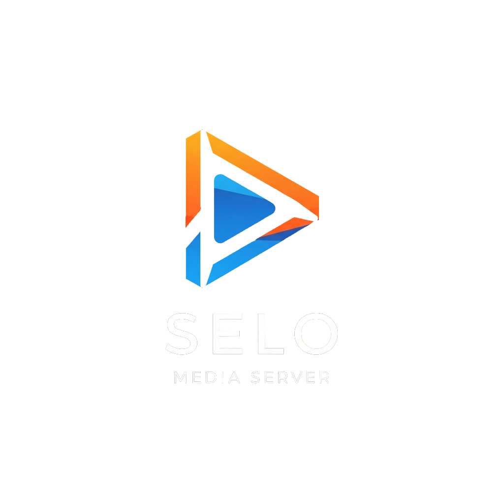

# SELO Media Server



A modern, open-source media streaming server for your personal media collection.

Developed by [SELODev](https://selodev.com) | [GitHub](https://github.com/selodesigns/selomserver)

[](https://opensource.org/licenses/MIT)
[](https://nodejs.org/)

---

## ✨ Features

- 🎬 **Streaming** - Stream your media from anywhere on your network
- 🔄 **Transcoding** - On-the-fly transcoding for compatibility with any device
- 📱 **Responsive UI** - Beautiful interface that works on desktop and mobile
- 🔐 **User Management** - Create accounts for family and friends
- 📚 **Media Library** - Organize your movies, TV shows, and music
- 🔎 **Search & Discovery** - Find content easily with powerful search
- 📝 **Metadata** - Automatic fetching of movie and TV show information
- ⚡ **Performance** - Optimized for speed and efficiency
- 🔧 **Customizable** - Extensive configuration options

---

## 🖼️ Screenshots

<div align="center">
  <p><i>Screenshot previews coming soon</i></p>
  
</div>

---

## 💻 System Requirements

- **Node.js**: v18.0.0 or higher
- **FFmpeg**: Required for transcoding and thumbnail generation

---

### ⚠️ Windows/Vite "Too Many Open Files" Fix

If you see errors like `EMFILE: too many open files` during the build, this is caused by the operating system limiting the number of files that can be opened at once. This is especially common on Windows and with large dependency trees (e.g., @mui/icons-material).

**This project automatically applies [graceful-fs](https://www.npmjs.com/package/graceful-fs) via a prebuild script (`patch-fs.js`) that runs before every build.**

No manual action is required. If you still encounter file handle errors, please report an issue on GitHub with your OS and Node version.
- **Storage**: Space for your media library
- **RAM**: 2GB minimum (4GB+ recommended)
- **CPU**: 2+ cores recommended for transcoding
- **OS**: Windows, macOS, or Linux

---

## 🚀 Quick Start

Get up and running with just three commands:

```bash
# Clone the repository
git clone https://github.com/selodesigns/SELOMServer.git

# Navigate to the project directory
cd SELOMServer

# Run the quick start script
node scripts/quick-start.js
```

The quick start script will:
1. Check for required dependencies
2. Install Node.js packages
3. Set up basic configuration
4. Create necessary directories
5. Start the server

After installation, access SELO Media Server at: http://localhost:32420

---

## 🚀 Ubuntu Quick Install

For Ubuntu 22.04+:

```bash
sudo apt update
sudo apt install -y nodejs npm ffmpeg git
# (Optional) Install build tools for native modules
sudo apt install -y build-essential

# Clone and set up
git clone https://github.com/selodesigns/SELOMServer.git
cd SELOMServer
node scripts/quick-start.js
```

- Default web interface: http://localhost:32420
- Media library path and other settings can be configured in `server/.env` or `server/config`.

---

## 📋 Installation

### Detailed Installation

For a more customized installation, follow these steps:

#### Linux / macOS

```bash
# Clone the repository
git clone https://github.com/selodesigns/SELOMServer.git

# Navigate to the project directory
cd SELOMServer

# Make the install script executable
chmod +x scripts/install.sh

# Run the install script
./scripts/install.sh
```

#### Windows

```powershell
# Clone the repository
git clone https://github.com/selodesigns/SELOMServer.git

# Navigate to the project directory
cd SELOMServer

# Run the install script
.\scripts\install.ps1
```

For more detailed installation instructions, see [INSTALLATION.md](docs/INSTALLATION.md).

---

## ⚙️ Configuration

SELO Media Server can be configured through environment variables or a `.env` file in the server directory.

### Basic Configuration Options

| Option | Description | Default |
|--------|-------------|---------|
| `PORT` | Port number for the web server | 32400 |
| `SERVER_NAME` | Name of your media server | SELO Media Server |
| `MEDIA_LIBRARY_PATH` | Path to your media library | ./data/media |
| `LOG_LEVEL` | Logging level (error, warn, info, verbose, debug) | info |
| `ENABLE_TRANSCODING` | Enable or disable transcoding | true |
| `DEFAULT_QUALITY` | Default streaming quality | 1080p |

For complete configuration options, see [CONFIGURATION.md](docs/CONFIGURATION.md).

---

## 🚢 Docker Support

SELO Media Server can be run in a Docker container:

```bash
# Pull the Docker image
docker pull selodesigns/selomserver:latest

# Run the container
docker run -d \
  --name selomserver \
  -p 32400:32400 \
  -v /path/to/media:/app/data/media \
  -v /path/to/config:/app/data/config \
  selodesigns/selomserver:latest
```

For detailed Docker instructions, see [docker-compose.example.yml](config/docker-compose.example.yml).

---

## 🔌 API

SELO Media Server provides a comprehensive REST API for integration with other applications.

### Example API Requests

```bash
# Get server info
curl -X GET http://localhost:32420/api/server/info -H "Authorization: Bearer YOUR_TOKEN"

# List all movies
curl -X GET http://localhost:32420/api/library/movies -H "Authorization: Bearer YOUR_TOKEN"

# Start playback
curl -X POST http://localhost:32420/api/playback/start -H "Authorization: Bearer YOUR_TOKEN" \
  -d '{"mediaId": "123", "quality": "1080p"}'
```

For complete API documentation, see [API.md](docs/API.md).

---

## 🛠️ Troubleshooting

Common issues and their solutions:

- **Server won't start**: Check Node.js version and required dependencies
- **Media not found**: Ensure your media paths are configured correctly
- **Transcoding fails**: Verify FFmpeg is installed and accessible
- **Performance issues**: Check system resources and adjust transcoding settings

For more troubleshooting help, see [TROUBLESHOOTING.md](docs/TROUBLESHOOTING.md).

---

## 🤝 Contributing

Contributions are welcome! Please feel free to submit a Pull Request.

1. Fork the repository
2. Create your feature branch (`git checkout -b feature/amazing-feature`)
3. Commit your changes (`git commit -m 'Add some amazing feature'`)
4. Push to the branch (`git push origin feature/amazing-feature`)
5. Open a Pull Request

For more details, see [CONTRIBUTING.md](CONTRIBUTING.md).

---

## 📜 License

This project is licensed under the MIT License - see the [LICENSE](LICENSE) file for details.

---

## 📞 Support

- Check the [documentation](docs/)
- Open an [issue](https://github.com/selodesigns/selomserver/issues)

---

## 🙏 Acknowledgements

- [FFmpeg](https://ffmpeg.org/) - For media processing capabilities
- [Node.js](https://nodejs.org/) - JavaScript runtime
- [React](https://reactjs.org/) - Frontend UI library
- [Material-UI](https://mui.com/) - React UI framework
- [Express](https://expressjs.com/) - Web server framework
